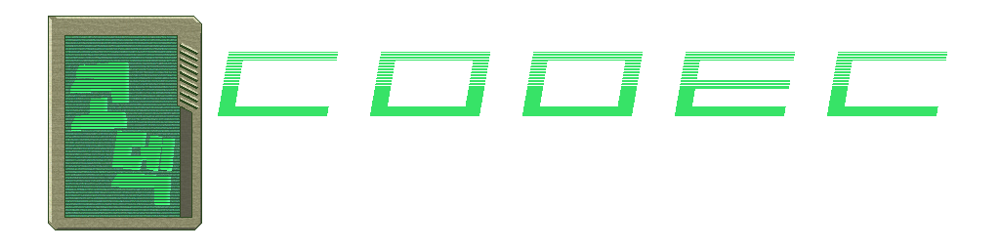
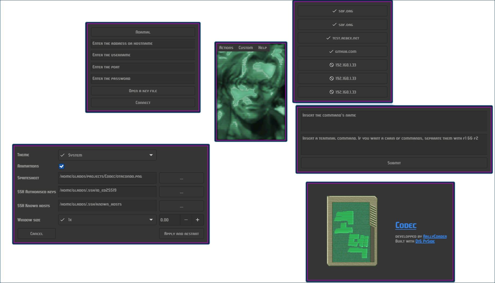

## *A small companion program to help with some daily task*

The program aims to allow swift interactions with graphical feedback. It is built entirely in python with Qt. The software is highly customisable, from the UI to the whole workflow — through the use of custom user commands and modules.

## Modules [prone to change]
- Developer module
    - Add an SSH connection
    - Check currently saved connections

## Installation [prone to change]
As of now, installation goes as such:

- Download the repo via

`$ git clone https://github.com/RallyCorder/Codec.git`

or through the github website.

### Dependencies
- `python`
- `pyside6`
- `python-paramiko`
- `adwaita-qt6 [optional, for light & dark themes]`

All these packages should be able to be installed through regular user repositories, though `adwaita-qt6` may require the usage of an assistant such as `yay`
### Out of box
After installing all the dependencies, simply run the *setup.py* in a terminal via 

`$ python /path/to/Codec/setup.py`

After this, the program can simply be run by doing 

`$ python /path/to/Codec/main.py`

## Documentation
See the docs.md file, that includes philosophy of the software, usage guidelines and developer commentary. Check in regularly, as updates to the software will be followed by docs updates.

## !For Wayland Users!
Due to how Wayland's protocol functions currently, moving the windows automatically isn't possible yet. I'm currently trying to find a way to resolve the issue, but I'm mostly relying on new Qt and Wayland additions. You may need to tinker with your DE's config to make the software function.
